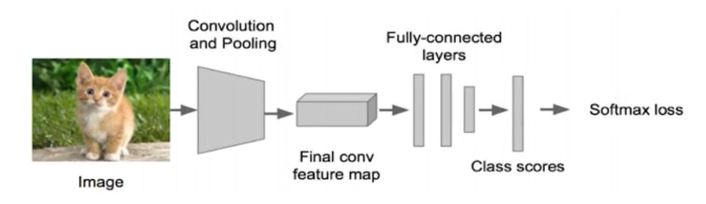
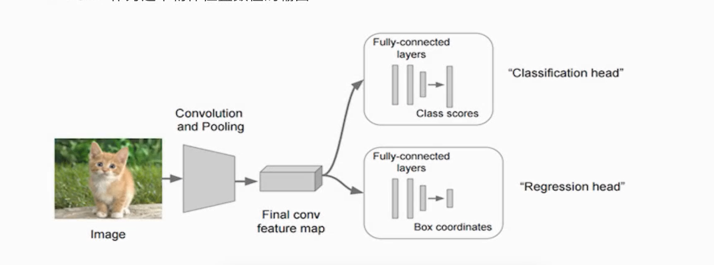
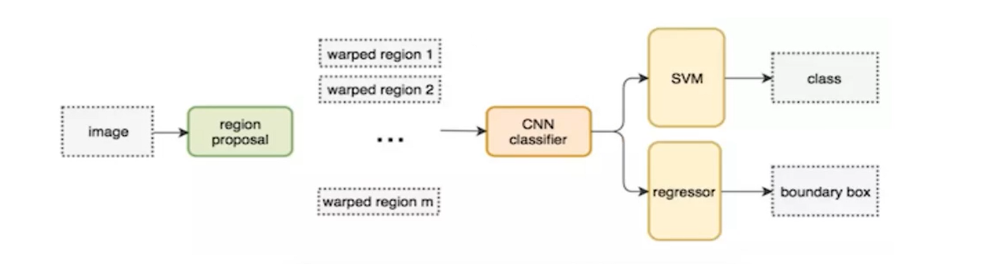
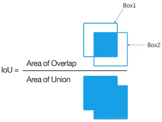

# 目标检测
## 项目结构
- 数据采集层：数据收集标注
- 深度模型层：YOLO，SSD模型，模型导出，Serving部署
- 用户层：前端交互，（web后台）对接部署的模型


## 项目过程
#### 算法类别
  - 两步走的目标检测
    1. 先找出候选的一些区域
    2. 对区域进行调整，分类
  - 端到端的目标检测
    1. 采用一个网络一步到位
    2. 输入图片，输出有哪些物体，物体在什么位置

##### 两步走目标检测
1. 先进行区域推荐
2. 进行目标分类

3. 如：R-CNN、SPP-net、Fast R-CNN、Fast R-CNN

##### 端到端物体检测
使用一个网络，一步到位，输入图片，输出有哪些物体，物体在上面位置

如： YOLO、SSD

#### 目标检测任务
##### 分类
**分类问题：** 将待分类图片经过卷积（层）、激活（层）、池化（层）后输出（全连接层）输出每个类别的概率。

**分类问题的损失与优化：**
- 在训练时需要计算每个样本的损失，那么CNN做分类的时候使用softmax函数计算结果，损失未交叉熵损失。


##### 检测
- 分类
  - N个类别
  - 输入：图片
  - 输出类别标签
  - 评估指标：Accuracy
- 定位：
  - N个类别
  - 输入：图片
  - 输出：物体的位置坐标
  - 主要评估指标：IOU
> 定位的位置坐标的输出：bounding box(bbox)
- 物体位置
  - x,y,w,h : x,y物体中心点位置，以及中心点距离物体两边的长宽
  - xmin,ymin,xmax,ymax : 物体的左上角、右下角坐标

物体检测的实现――――>在网络输出层的最后加上位置信息

对于位置检测的训练，就是对预测的位置坐标信息与实际位置坐标信息进行损失计算。这里可使用**均方误差(MSE)** 进行损失计算

####### Bounding box
- Ground-truth bounding box: GT图片真实目标位置(标记的结果)
- Predict bounding box: 预测的Bounding Box


- 分类与定位：需要图片中只有一个物体需要检测
- 目标检测：图片当中有多个物体需要检测

## 多种模型评估
### R-CNN
- 对于多目标情况，其位置预测输出置的数量是不定的。
#### overfeat模型
##### 滑动窗口
我们在进行目标检测的时候，直接从左到右、从上到下，进行滑动窗口，然后对这些窗口进行分类识别目标。
> 通过不断的检测窗口内是否有物体，有什么物体。

因为，不同的物体对应的检测bounding box不同，所以需要提前设定多个窗口(k个)，每个窗口滑动提取m个，总共k*m个图片，然后在同图像分类工作，将这些图片进行变换成固定大小的图像，
再将变形的图片块输入到CNN分类器中。
1. 滑动分割图片为k*m个图片块
2. 处理图片成相同大小
3. 将图片输入到卷积神经网络分类器中

该方法就将**物体检测问题转换成了图形分类问题**

**缺点：** 该模型的缺点十分明显，就是算量太大，会占用大量算力

#### R-CNN提出
为解决滑动窗口的大算力要求，采用**候选区域方法(region proposal method)**

1. 找出图片中可能存在的目标的获选区域region proposal（原论文提到为2000个对于一张图片）
2. 将候选区域调整为适应AlexNet网络(原文选择的CNN网络)的输入图像大小227*227，通过CNN对候选区域提取特征向量，2000个建议框的CNN特征组合成网络AlexNet最终输出:2000*4096维矩阵
3. 将2000*4096维特征经过SVM分类器(20种分类器，SVM是二分类器，需要使用20个SVM)，获得2000*20种类别矩阵(类别概率)
4. 分别对2000*20维矩阵进行 **非极大值抑制(NMS,non-maximum suppression)**,取出不好的，重叠度高的一些候选区域，得到剩下分数高的，结果好的bbox
5. 修正候选框bbox，对bbox进行回归微调

##### 候选区域（Region of Interest，ROI）选择
选择候选区域使用到**选择性搜索算法(SelectiveSearch, SS)** 进行划分。

**选择性搜索算法：** 将每个像素作为一组，然后计算出每一组的纹理，并将两个最接近的组结合起来。为了避免单个区域吞噬其他区域，首先对较小的组进行分组。然后继续合并区域，直到所有区域都结合在一起。 

##### 特征分类
原方案是使用SVM对卷积输出的特征向量进行分类。有多少种类别则有多少个SVM分类器。并分别对这些特征向量进行分类打分，通过打分确定类别。

##### 非极大抑制 NMS
**非极大抑制：** 用于筛选候选区域，目标是一个物体只保留一个最优的框，来抑制那些冗余的候选框

使用NMS将RCNN中得到的2000个候选框进行筛选出对应物体数量个框：
- 对2000个候选区域得分进行概率筛选，将将概率小于0.5的剔除掉
- 剩余的框，计算每个物体位置与其所对应的候选框的交并比IoU，留下IoU最大的框。
> 及占有重叠区域最多的bbox


##### 修正候选框
上面提到使用选择性搜索算法搜索出候选框，但是存在这些候选框并不准确的情况，这个时候我们就需要进行修正候选框。

在这里我们采用**回归**的方法进行修正候选区域，将候选区域的位置坐标与准确位置坐标(ground truth)进行回归拟合训练，使得最后得到的线性表达式可以将候选区域处理的接近于真实位置。

候选区域:R(x,y,w,h) 

实际位置坐标:GT(x,y,w,h)

> F(R(x,y,w,h)) = α GT(x,y,w,h)   

使得： 修正后候选区域R' ≈ GT

## 项目评估
### IoU交并比
将预测出的候选框bbox位置与实物位置区域做IoU交并比



### 平均精确率(mean average precision,map)
IoU用于检测位置准确，map用以考量分类准确度。
#### 样本分类标记
上文提到过非极大抑制，其中有选择最优框的过程
- 将与实物位置框(ground-truth box)有着最大IoU的候选框标记为**正样本**
- 剩下的候选框与任意实物位置框的IoU大于0。7的记为**正样本**，IoU小于0.3的记为**负样本**

#### MAP
**MAP** 是多个分类任务的AP的平均值

MAP = 所有类别AP之和 / 类别数

**AP（average precision）：** ```PR曲线(精确率曲线)```下的面积（ROC,AUC）。

1. 对于其中一个类别，首先将算法输出的所有该类别的预测框，按照预测的分数confidence排序
2. 设定不同的k值，选择top k个预测框，计算FP(假正类)和TP(真正类)，计算AP，即AUC(Accuracy = (TP + TN) / n)
3. 将得到的每个类别的AP取平均，得到单个类别的AP；再将所有类别的AP进行取平均，得到MAP
