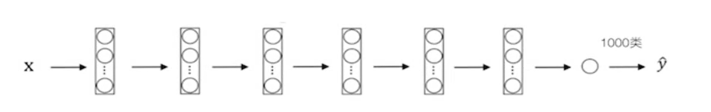

# Machine Vision based CNN
机器视觉基于CNN卷积神经网络。
## 迁移学习
**迁移学习：** 利用数据、任务和模型间的相识性，将旧的领域学习过或训练好的模型，应用于新的领域这样的一个过程。
> 注意：这两个任务的输入属于同一性质：都是图像或者都是语音或者都是其他别的。

`原模型(具有较好的基础参数)--->修改原模型的输出结果--->得到新的模型(适用于新的情形)`

- 在具有海量数据资源的时候，就可以不使用迁移学习。可以直接使用深度学习训练出一个鲁棒性好的模型
- 迁移学习可以降低训练成本，站在巨人的肩膀上，从头训练需要较长时间且需要依赖较大的GPU资源。

### 微调（fine-tuning）
**微调：**
- 调整模型参数，不需要大量调整
- 调整模型结构，不需要大量调整

**预训练模型(pre-trained model):** 就是用来进行迁移学习的样本模型。
https://github.com/tensorflow/models/tree/master/research/slim

### 迁移学习步骤

1. 建立自己的网络，在预训练模型基础上，修改最后输出结构，并加载与训练模型的模型参数
2. 根据数据大小调整
   - 如果待训练模型数据量小，那么我们可以选择将预训练模型的所有的层进行freeze(可以通过Tensorflow的trainable=False参数实现)，而剩下的输出层部分可以选择调整参数训练。
   - 如果待训练模型数据量大，那么我们可以将预训练模型中一半或者大部分的层进行freeze，而剩下的部分的layer可以进行新任务数据基础的微调。

