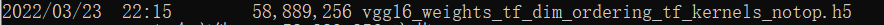
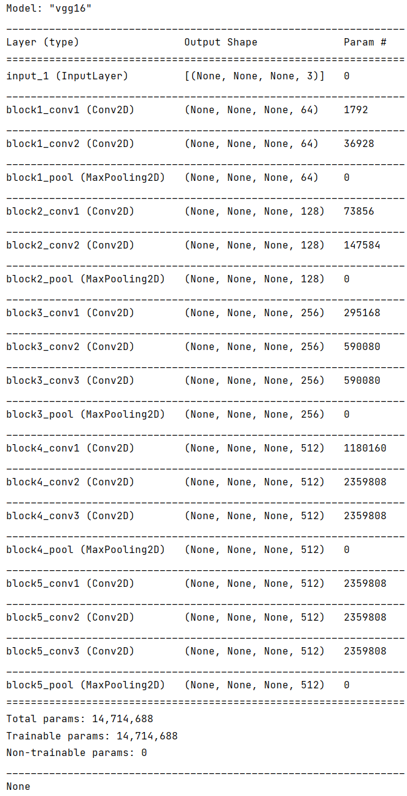
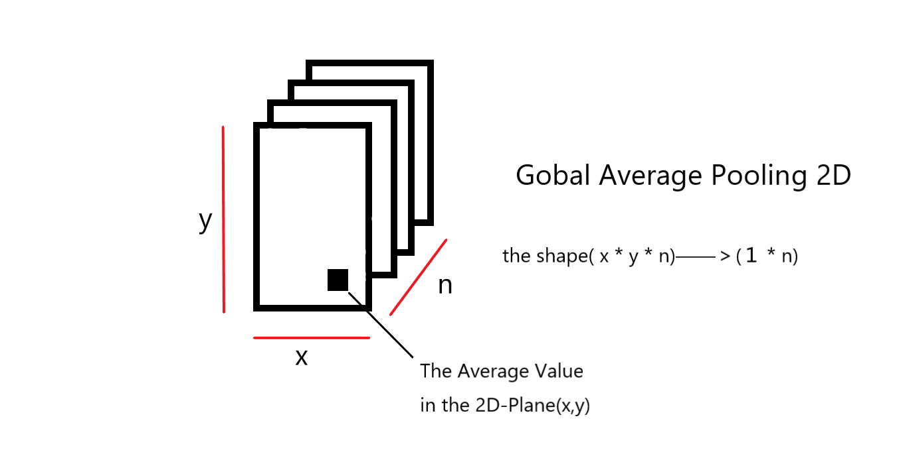

# Machine Vision based CNN
机器视觉基于CNN卷积神经网络
## 迁移学习
**迁移学习：** 利用数据、任务和模型间的相识性，将旧的领域学习过或训练好的模型，应用于新的领域这样的一个过程。
> 注意：这两个任务的输入属于同一性质：都是图像或者都是语音或者都是其他别的。

`原模型(具有较好的基础参数)--->修改原模型的输出结果--->得到新的模型(适用于新的情形)`

- 在具有海量数据资源的时候，就可以不使用迁移学习。可以直接使用深度学习训练出一个鲁棒性好的模型
- 迁移学习可以降低训练成本，站在巨人的肩膀上，从头训练需要较长时间且需要依赖较大的GPU资源。

### 微调（fine-tuning）
**微调：**
- 调整模型参数，不需要大量调整
- 调整模型结构，不需要大量调整

**预训练模型(pre-trained model):** 就是用来进行迁移学习的样本模型。
https://github.com/tensorflow/models/tree/master/research/slim

### 迁移学习步骤

1. 建立自己的网络，在预训练模型基础上，修改最后输出结构，并加载与训练模型的模型参数
2. 根据数据大小调整
   - 如果待训练模型数据量小，那么我们可以选择将预训练模型的所有的层进行freeze(可以通过Tensorflow的trainable=False参数实现)，而剩下的输出层部分可以选择调整参数训练。
   - 如果待训练模型数据量大，那么我们可以将预训练模型中一半或者大部分的层进行freeze，而剩下的部分的layer可以进行新任务数据基础的微调。

# VGG
该项目基于现有VGG模型
1. 准备训练集与测试集
2. 修改模型分类层
3. freeze原始VGG模型
4. 训练模型
5. 输入数据进行预测

## 准备训练集与测试集
### 相关api
- ImageDataGenerator()
   - 定义数据的转换，与数据增强
   - 生产图片的批次张量值并提供数据增强功能
   - rescale=1.0 / 255,:标准化
   - zca_whitening=False: # zca白化的作用是针对图片进行PCA降维操作，减少图片的冗余信息
   - rotation_range=20:默认0， 旋转角度，在这个角度范围随机生成一个值
   - width_shift_range=0.2,:默认0，水平平移
   - height_shift_range=0.2:默认0， 垂直平移
   - shear_range=0.2:# 平移变换
   - zoom_range=0.2:
   - horizontal_flip=True:水平翻转


- train_generator = ImageDataGenerator()
  - flow(x, y, batch_size)
    - 直接从文件读取
  - flow_from_directory(
    - directory=path,# 读取目录 
    - target_size=(h,w),# 目标形状 
    - batch_size=size,# 批数量大小 
    - class_mode='binary', # 目标值格式 
    - shuffle=True)
      - 从本地读取
      - 该api要求数据存储格式固定
```
data/
    train/
        dogs/
            dog001.jpg
            dog002.jpg
            ...
        cats/
            cat001.jpg
            cat002.jpg
            ...
    validation/
        dogs/
            dog001.jpg
            dog002.jpg
            ...
        cats/
            cat001.jpg
            cat002.jpg
            ...
```

> 注意这里在进行数据增强后，在训练的时候也要将增强数据放进去，该使用fit_generator()，而不是fit()

## 修改模型分类层
### VGG-notop模型
在运行完代码后
在根目录下有一个```.keras```，其中的```models```文件夹中就生成一个VGG的notop模型

- notop模型不包含最后三个全连接层，专门用来fine-tuning，不需要我们来自主进行删除

VGG16源码片
```python
 if include_top:
    # Classification block
    x = layers.Flatten(name='flatten')(x)
    x = layers.Dense(4096, activation='relu', name='fc1')(x)
    x = layers.Dense(4096, activation='relu', name='fc2')(x)

    imagenet_utils.validate_activation(classifier_activation, weights)
    x = layers.Dense(classes, activation=classifier_activation,
                     name='predictions')(x)
  else:
    if pooling == 'avg':
      x = layers.GlobalAveragePooling2D()(x)
    elif pooling == 'max':
      x = layers.GlobalMaxPooling2D()(x)

 # Ensure that the model takes into account
  # any potential predecessors of `input_tensor`.
  if input_tensor is not None:
    inputs = layer_utils.get_source_inputs(input_tensor)
  else:
    inputs = img_input
  # Create model.
  model = training.Model(inputs, x, name='vgg16')
  
  # Load weights.
  if weights == 'imagenet':
    if include_top:
      weights_path = data_utils.get_file(
          'vgg16_weights_tf_dim_ordering_tf_kernels.h5',
          WEIGHTS_PATH,
          cache_subdir='models',
          file_hash='64373286793e3c8b2b4e3219cbf3544b')
    else:
      weights_path = data_utils.get_file(
          'vgg16_weights_tf_dim_ordering_tf_kernels_notop.h5',
          WEIGHTS_PATH_NO_TOP,
          cache_subdir='models',
          file_hash='6d6bbae143d832006294945121d1f1fc')
    model.load_weights(weights_path)
  elif weights is not None:
    model.load_weights(weights)

  return model
```
下面是VGG16（imgenet）模型报告

### 全局平均池化(GobalAveragePooling2D)
在进行迁移学习中，仅需要去训练后面的全连接层，所以不需要大量的参数，使用过多参数会导致过拟合。
例如：输出大少为shape=[8,8,2048],通过全局平均池化后，将8*8的64位向量进行取均值，所以原本的8*8*2048就转变成了1*2048


## 冻结预训练模型
如果我们模型的测试集大，就可以将模型的所有参数拿出来一起训练；
如果我们模型的测试集小，就将模型前面层冻结，只训练全连接层的参数

**做法：** 将要冻结的每层中的trainable参数设置为`False`
```python
layer.trainable = False  
```

```python
# 将基类模型中的每一层进行冻结
for layer in self.base_model.layer:
    layer.trainable = False
```

## 训练模型
- 编译模型
  - 优化器：Adam
    - optimizer=keras.optimizers.Adam()
  - loss损失计算：交叉熵损失
    - loss=keras.losses.sparse_categorical_crossentropy
  - 评估矩阵
    - metrics=['accuracy']

- 训练模型
  - 数据增强过，需要使用fit_generator()
    - 在fit_generator()的callbacks中可以加入ModelCheckpoint进行记录每次迭代的准确率，fit()是加不进去这个monitor的
    - 在新版本的tensorflow中fit_generator()已经被弃用了，fit()合并了fit_generator()的作用

### ModelCheckpoint
- 这里检测验证准确率“val_acc”(注意在新版本中，这里可能要改成“val_accuracy”)
- 只保留权重参数
- 只保留最好的模型
- 自动检测最大准确率与最小的loss

```python
modelckpt = keras.callbacks.ModelCheckpoint('./ckpt/transfer_{epoch:02d}-{val_acc:.2f}.h5',
                                                     monitor='val_acc',
                                                     save_weights_only=True,
                                                     save_best_only=True,
                                                     mode='auto',
                                                     period=1)
```

## 输入数据进行预测
再训练完模型后需要保存模型，并在之后加载模型使用
- 保存模型
```python
model.save_weights("./xxx.h5")
```
- 加载模型
```python
model.load_weights("./xxx.h5")
```


    


